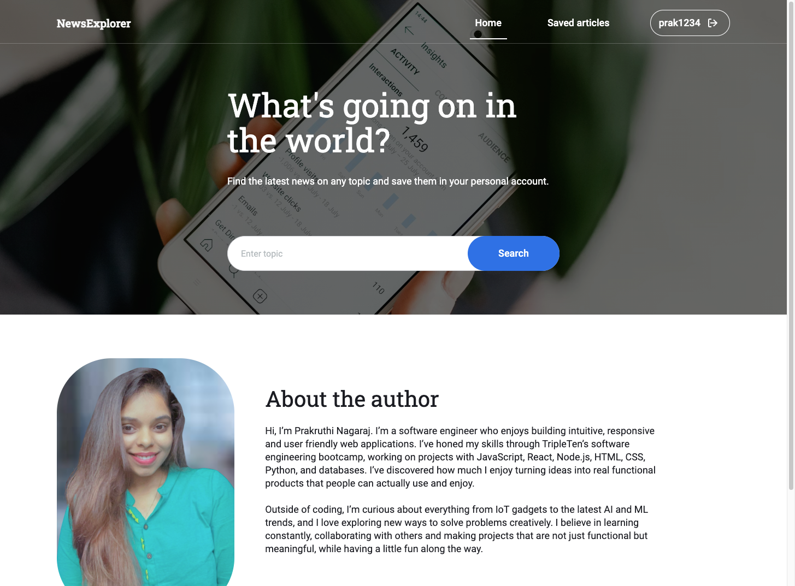
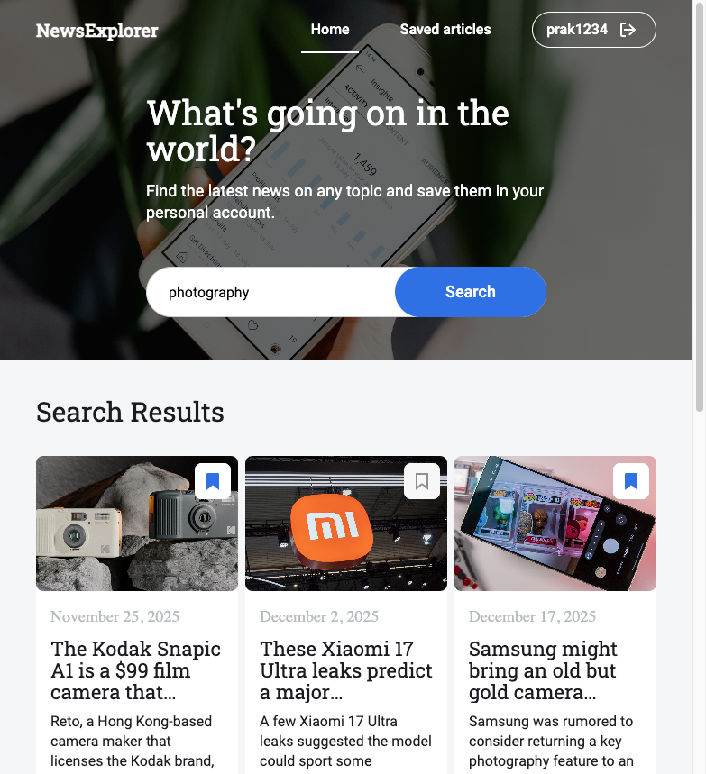
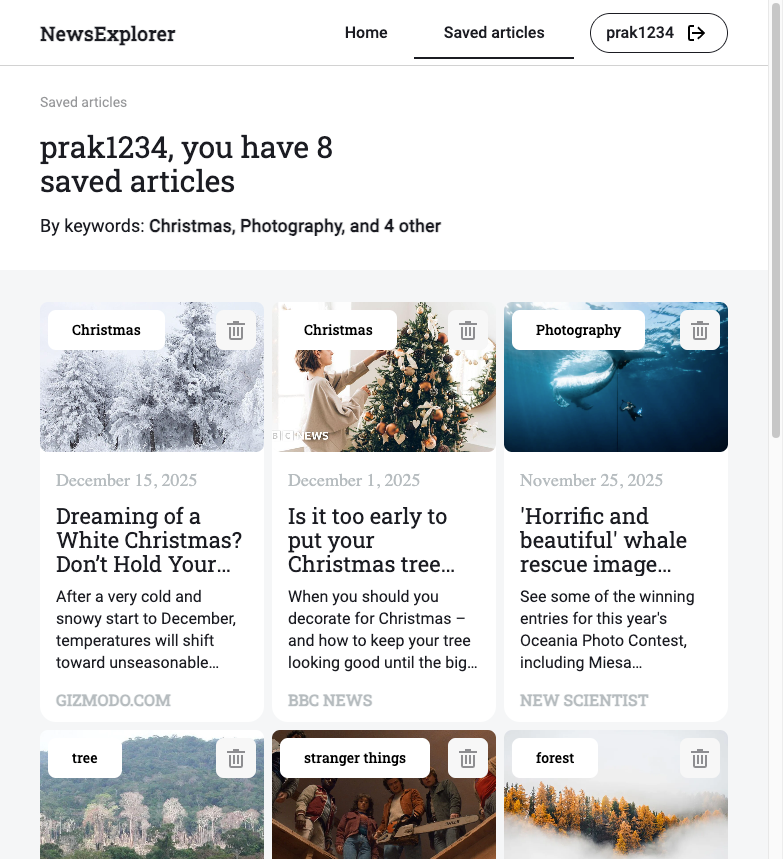
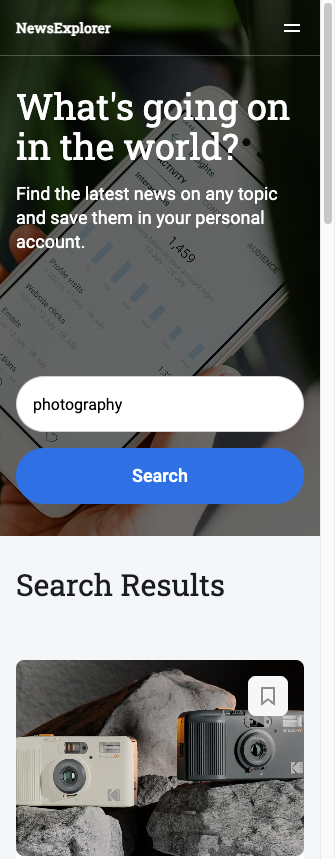
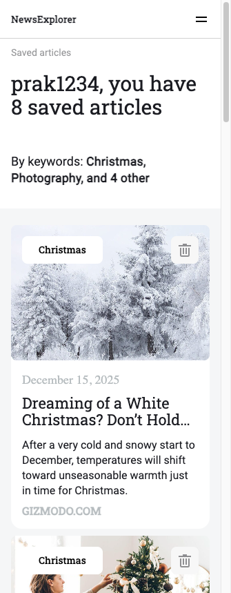
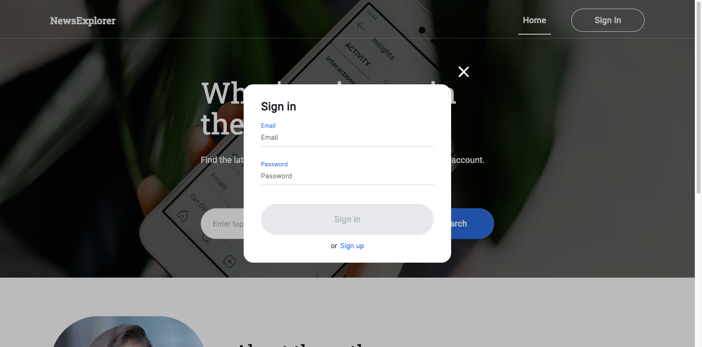
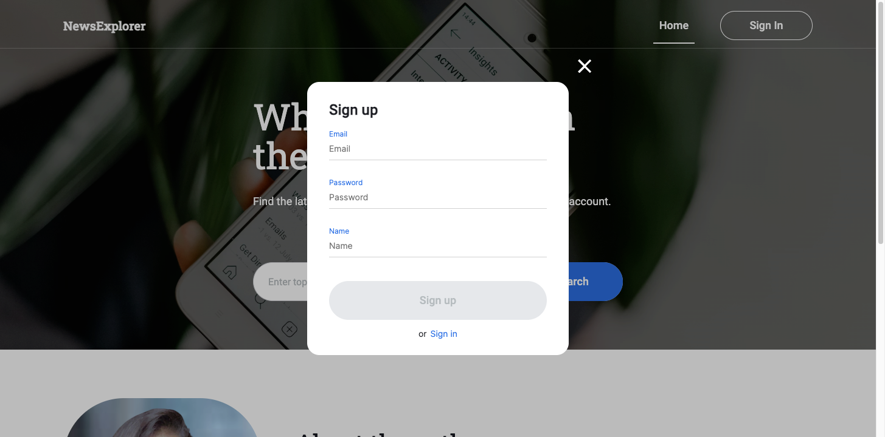

# News Explorer

**News Explorer** is a responsive web application that allows users to search for news articles using a third-party API (NewsAPI). Users can view articles, save them (if logged in), and manage saved news. The project follows the Figma design and is developed using React.

## Features

- Search news articles by keyword
- Display results as cards with title, description, image, source, and date
- Save and delete articles (requires login)
- Preloader animation while fetching news
- Responsive layout for desktop, tablet, and mobile
- Modal windows for login and registration

## Tech Stack

- **Frontend:** React (functional components, JSX, CSS)
- **Routing:** React Router
- **API:** NewsAPI
- **Backend simulation:** json-server
- **Tooling:** Vite, Node.js, npm
- **Design:** Figma (custom fonts: Roboto, RootoSlab, Inter)

## Frontend

### Installation

1. Clone the repository:

```bash
git clone <repository-url>
cd news_explorer_react
```

2. Install dependencies:

```bash
npm install
```

### Running the Frontend

Start the React development server:

```bash
npm run dev
```

## Backend (Simulated)

To simulate backend responses using JSON Server:

```bash
json-server --watch db.json --id _id --port 3001
```

This will serve your db.json file at http://localhost:3001

Supports saving and deleting news articles in the simulated database.

## Usage

1. Open the application in a browser.
2. Use the search bar to enter a keyword and search for news.
3. News articles will be displayed as cards.
4. Bookmark articles by clicking the save icon (requires login).
5. View saved articles in the **Saved News** section.
6. Open login/register modals to sign in or create an account.

## Test Credentials

You can use the following test account to explore authenticated features such as saving and deleting articles:

- **Email:** testuser1234@gmail.com
- **Password:** test1234

> These credentials are for demonstration purposes only and work with the simulated backend powered by `json-server`.

## Screenshots

### Desktop View




### Tablet View




### Mobile View




### Modals



